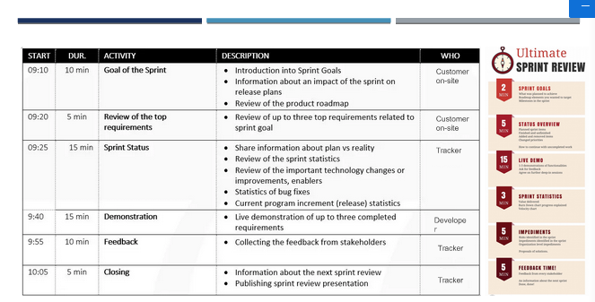

# Agile, the way forward

- Verras je team niet met nieuwe dingen tijdens een retro behandel deze eerder ook al.

## demo and retro good-practices

Tijdens een demo moet de hoofdzaak zijn feedback te verzamelen. Nu in sprint 0 gaat dit over het laten zien van wat we hebben gedaan, en of dit optimaal is.

- Je maakt aannames
- Die ga je uitwerken
- Hier werk je de sprint mee uit
- Daar haal je feedback mee op
- Die feedback verwerk je in de volgende sprint

Feedforward is belangrijk, in de demo heb je de kans om te laten zien dat je als team in de lead bent, en in control bent. Je weet waar je het over hebt en zo een mooi resultaat oplevert.
Denk vooraf aan wat je binnen de demo aan feedback op wilt halen, ruim voordat je de demo doet. Deel deze demo dan ook voorafgaand aan de afspraak zodat de stakeholder al weet wat hij/zij kan verwachten en al vragen heeft etc.

Zorg er ook voor dat je goed bent voorbereid. De onsite-customer en de tracker voelen zich verantwoordelijk voor de demo. De onsite-customer voor het product, en de tracker vanwege wat af is ten opzichte van de planning.
Een agenda is ook een goede tool. Plan hoe de demo zal verlopen.

- Doel en agenda van review
- terugblik: wat is er gedaan met de input n.a.v. de vorige demo
- overzicht: wat heb je gerealiseerd/uitgewerkt. Niet perse code/programma, kan ook een steen zijn wat daar toe leid
- checkout: haal feedback op

Zorg ervoor dat het niet saai wordt. Schrijf alle feedback gelijk op om later te behandelen en zodat de stakeholder ook ziet dat je er actief mee aan de gang gaat.

Duur: 30-60 uur

Ga heel zuinig om met deze demo. Het is waarschijnlijk een van de weinige momenten om de klant te spreken.

### houd het leuk/niet saai

- Spreek een rol verdeling af om zo het netjes te laten verlopen: wie presenteerd, wie schrijft de feedback in realtime op en wie is de facilitator?
- Doe een voorstel rondje. Laat weten wie jullie zijn, en welke rol wie heeft.
- Zorg voor wat interactie
    - Wat is goed?
    - Waar twijfel je aan
    - Hoe zou je het scherper kunnen maken?
- Haal zoveel mogelijk informatie op, dit is **het moment**.
- Haal het persoonlijke er af, werk zoveel mogelijk aan de hand van je rol.
- Ga je niet verdedigen, zeg: Ik neem het mee. Zo voorkom je discussies en kan je het met je team bespreken

## Evalueer je demo regelmatig

- Heb een checklist
    - Waren we een goede host 
        - online: dat je bijvoorbeeld het eerst even persoonlijk houdt omdat je connectie eye eye mist
        - On-site: Geef even koffie, of verzorg water, etc.
    - Waren de juiste mensen aanwezig
        - Hebben we zo de juiste feedback binnen
    - Waren we in control
        - Merkte je dat je klant het gesprek overname en bijvoorbeeld een discussie veroorzaakte, toets deze control van te voren.
    - Probeer als teamcoach te meten of er een goede sfeer was
    - Was er voldoende interactie
    - Qualitatieve feedback
    - Hebben we ons doel berijkt
    - Hebben we als team geschitterd
        - Zijn we blij met ons product en demo

Zit niet honderd procent in de presentatie, maar houd je ook bezig met de klant. Vermijd discussies.

- Zorg voor een goede facilitator
    - Deze opent de presentatie
    - Stopt discussies
    - Grijpt in op verkeerde momenten
        - Leg uit waarom
        - Neem het mee om volgende keer te voorkomen

Weet van te voren dan ook waar je heen wilt, om zo de stakeholder de goede kant op te leiden.

### inrichting demo

Review canvas is ook een manier om voorafgaand je doel en demo in te richten. Deze is te vinden op learn. Hierbij geld ook het vast stellen van instrumenten (bijvoorbeeld stiften voor bord als visualisatie)

Onsite customer is vertegenwoordiger van de klant

## Vragen

### Sprint 0 oplevering

- Werk vooral primair uit je rol, laat duidelijk overkomen wie welke rol heeft in het gesprek

### Omgeslagen sfeer oplossen

- Pas je aan aan het type klant/stakeholder
- Pas aan hoe de stakeholder dan is
- Handel team problemen later af in een nabespreking

### Overmatige verwachtingen managen

- Stel van te voren op wat je max kan doen in sprint
- Maak aan de hand hiervan keuzes
- De opdrachtgevers weten dat we niet verplicht zijn resultaat te leveren als student
- Nooit goedkeuring vragen/beloven
    - Wat wil ik hebben : stakeholder en onsite-customer
    - Hoe : tracker
    - na demo verfijnen wat klant wilt
    - Aan de hand van user-stories inpacten en bepalen wat te doen tijdens sprint

