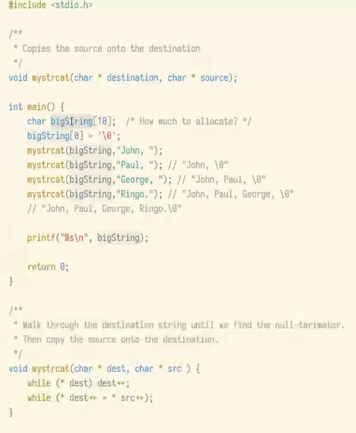
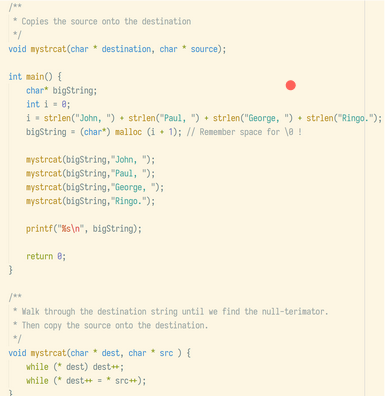

# les 2

## DATATYPE

- concept in je programmeertaal
- zegt iets over je data
- vertelt de computer hoe de data behandeld moet worden

Deze les gaan we het hebben over c in 32-bit systemen.
De meeste programmeertalen zijn in c geschreven

### int
Hoeveel bytes in een 32-bit int?
4, want 32/8bits is 4

### char
Hoeveel bytes in een 32-bit char?
1, want je hebt 8 bits in 1 byte, en daar kan je 256 combinaties maken

```c
#include <stdio.h>
int main() {
    int first= 2;
    int second= 8;
    int third = 1453;  
    int fourth = 2147483648;
                       
    printf("first is %i\n", first);
    printf("second is %i\n", second);      
    printf("third is %i\n", third);         
    printf("fourth is %i\n", fourth);       
                                           
    return 0;
}
```

Wat zijn de getallen die geprint worden?
    answer:
    ```
    first is 2
    second is 8
    third is 1453
    fourth is -2147483648
    ```

Die laatste is negatief ineens. Dit komt omdat er 2^31 gereserveerd is voor de int en er is er 1 voor positief of negatief. Omdat deze int te groot is wordt het dan dus negatief, omdat die laatste bit ook gebruikt wordt

---

Video gekeken: https://www.youtube.com/watch?v=5tJPXYA0Nec

Kortom, kijk goed naar welke datatypes gebruikt moeten worden.


### wat is een pointer?

Een pointer is een variabele in de code van datatype integer wat een geheugen adres is dat verwijst naar een andere waarde.

gedeclareerd door 
```c
int num = 1;
int * variabel = &num;
```

Op zich zelf nutteloos, waarde zit in verwijzingen.
Dit doe je met een & voor de variabele.
```c
#include <stdio.h>
int main() {
    int integer = 10; //op t geheugen 4 bytes met waarde 10

    int * pointer = &integer; //wijzen naar een int genaamt integer doormiddel van de &

    printf("%p\n", pointer);
    printf("%i\n", *pointer);

    return 0;
}
```

- Een pointer verwijst naar eerste byte van een var in het geheugen
- Dat maakt het ideaal voor sequentiele data

Een pointer is best te gebruiken bij bijvoorbeeld een string omdat je dan een int referenced ipv weer al die bytes die vast hangen aan een string/array

- pointers zijn ideaal voor dynamische data
- De pointer staat op de stack
- De waarde staat op de heap


### string
In c is dat een array van characters
eindigd met "\0": de null-terminator

inplicaties
- Je kan niet per ongeluk een \0 in je string hebben
- Je moet altijd op zoek naar de \0 voordat je iets kan doen met de string

*voorbeeld* van hoe je een string concat met pointers



Wat gaat hier fout:
Buffer overflow -> Bij buffer van 10, blijven overschrijven, zelfs over de pointer/return adres heen (meer dan 11x). Wordt meestal ingegrepen door os om dit te stoppen.

Hoe doe je dit goed?



```c
#include <stdio.h>                                       
#include <string.h>
#include <stdlib.h>

void mystrcat(char * destination, char * source);

int main() {                                             
    char* bigString;                                    
    int i = 0;
    i = strlen("John, ") + strlen("Paul, ") + strlen("George, ") + strlen("Ringo.");
    bigString =  (char*) malloc (i + 1);

    mystrcat(bigString, "John, "); //John,
    mystrcat(bigString, "Paul, "); //John, Paul
    mystrcat(bigString, "George, "); //John, Paul, George
    mystrcat(bigString, "Ringo."); //John, Paul, George, Ringo

    printf("%s\n", bigString);                            

    return 0;                                            
}    

void mystrcat(char * dest, char * src) {
    while (* dest) dest++;
    while (* dest++ = * src++);
}
```

##Huiswerk
- schrijf een versie van mystrcat die een maximale tijdcomplexiteit van 0(n) heeft
- Kan handig zijn om te oefenen met pointers:
    - [Pointers](learn-c.org/Pointers)
    - [array and pointers](learn-c.org/Arrays_and_Pointers)
